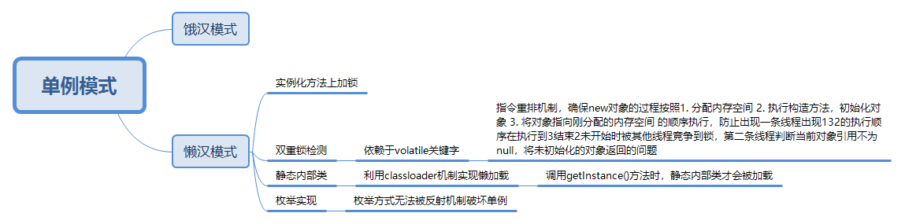

## 单例模式

单例模式大致分为五种实现方式



#### 饿汉式

* 在类加载时直接创建实例，供调用getInstance()方法时返回

``` java
public class Singleton {

    // 私有化构造方法，禁用new方式创建实例（可以通过暴力反射破坏单例）
    private Singleton() {
	}
    
	// 饿汉式
	private static final Singleton instance = new Singleton();

	public static Singleton getInstance() {
		return instance;
	}
	
}
```

#### 懒汉式

##### 静态方法锁

* 顾名思义，在获取实例的getInstance()静态方法上加锁做到线程安全，会显著影响效率

``` java
public class Singleton {

    // 私有化构造方法，禁用new方式创建实例（可以通过暴力反射破坏单例）
    private Singleton() {
	}
    
	private static  Singleton instance = null;
    
    // 方法锁
	public static synchronized Singleton getInstance() {
		if (instance == null) {
			instance = new Singleton();
		}
		return instance;
	}
	
}
```


##### 双重锁检测

* 利用同步代码块和volatile关键字的防止指令重排功能确保new对象的过程按照

1. 分配内存空间 

2. 执行构造方法，初始化对象

3. 将对象指向刚分配的内存空间 

    的顺序执行，防止出现一条线程出现132的执行顺序在执行到3结束2未开始时被其他线程竞争到锁，第二条线程判断当前对象引用不为null，将未初始化的对象返回的问题

    ``` java
    public class Singleton {
    
        // 私有化构造方法，禁用new方式创建实例（可以通过暴力反射破坏单例）
        private Singleton() {
    	}
        
        // volatile关键字，内存屏障，防止指令重排
    	private static volatile Singleton instance = null;	
    
        // 双重锁检测
    	public static Singleton getInstance() {
    		if (instance == null) {
    			synchronized (Singleton.class) {
    				if (instance == null) {
    					instance = new Singleton();
    				}
    			}
    		}
    		return instance;
    	}
    	
    }
    ```

    

##### 静态内部类

* 利用Java中的classloader类加载机制实现懒加载(只有在调用getInstance()方法的时候内部类才会被加载)

    ``` java
    public class Singleton {
    
        // 私有化构造方法，禁用new方式创建实例（可以通过暴力反射破坏单例）
        private Singleton() {
    	}
    
        // 静态内部类, 利用classLoader实现懒加载
    	// 只有在调用getInstance()方法时内部类SingletonHolder才会被加载
    	private static class SingletonHolder {
    		private static final Singleton instance = new Singleton();
    	}
    
    	public static Singleton getInstance() {
    		return SingletonHolder.instance;
    	}
    	
    }
    ```

    

##### 枚举实现（可防止出现利用暴力反射使单例模式失效的问题）

* 利用枚举类型不可以通过反射形式创建的规则屏蔽暴力反射

``` java
public enum SingletonHolder implements IDisplay {
   
	INSTANCE {
		@Override
		public void display() {
			System.out.println("singleton of enum...");
		}
	}
}

public interface IDisplay {

	void display();

}
```

* 枚举类型不可以通过反射方式实例化的依据（Constructor.java中的newInstance()方法）

``` java
@CallerSensitive
    public T newInstance(Object ... initargs)
        throws InstantiationException, IllegalAccessException,
               IllegalArgumentException, InvocationTargetException
    {
        if (!override) {
            if (!Reflection.quickCheckMemberAccess(clazz, modifiers)) {
                Class<?> caller = Reflection.getCallerClass();
                checkAccess(caller, clazz, null, modifiers);
            }
        }
        // 通过构造方法实例化的时候如果发现是枚举类型，抛出异常
        if ((clazz.getModifiers() & Modifier.ENUM) != 0)
            throw new IllegalArgumentException("Cannot reflectively create enum objects");
        ConstructorAccessor ca = constructorAccessor;   // read volatile
        if (ca == null) {
            ca = acquireConstructorAccessor();
        }
        @SuppressWarnings("unchecked")
        T inst = (T) ca.newInstance(initargs);
        return inst;
    }
```


关于利用暴力反射破坏单例模式的叙述详见：https://blog.csdn.net/zhuzicc/article/details/107411047?utm_medium=distribute.pc_relevant.none-task-blog-BlogCommendFromMachineLearnPai2-2.control&depth_1-utm_source=distribute.pc_relevant.none-task-blog-BlogCommendFromMachineLearnPai2-2.control