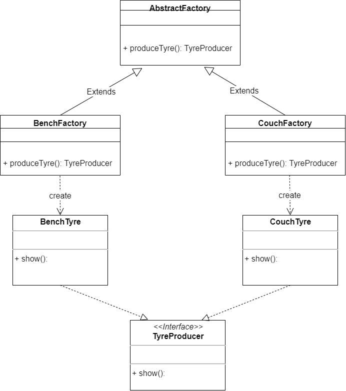
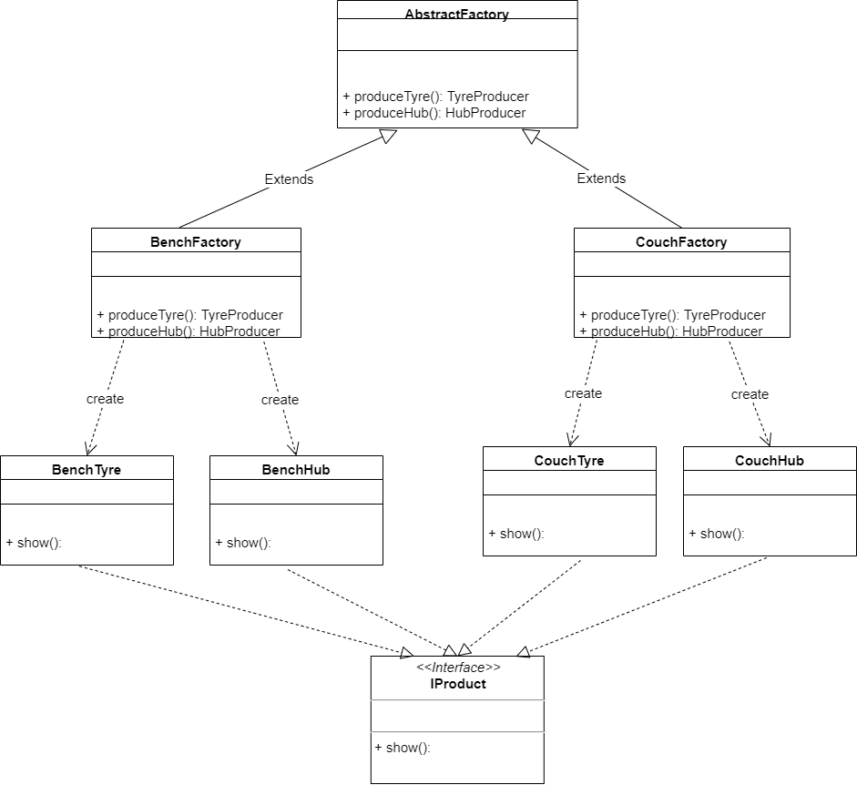

## 工厂模式


### 工厂方法模式

* 每一个工厂只可以生产_一种_具体的属于同一类的产品

*  需要新的工厂只需实现工厂接口覆写产品生产方法即可（符合开闭原则）
*  工厂抽象类中抽象出生产方法，返回产品的父类
*  新的产品也需要继承公有的父类（或实现接口）


>  以轮胎生产工厂为例：所有的具体产品即轮胎实现同一个抽象产品接口交由继承了父类工厂并重写了父类抽象工厂方法的具体工厂生产。





代码只给出部分产品实现作为示范

*抽象产品*

``` java
/**
 *
 * @Description 抽象产品，抽象出产品公有的方法
 */
public interface TyreProducer {
	void show();
}
```

*具体产品*

``` java
/**
 *
 * @Description 具体产品类
 */
public class BenchTyre implements TyreProducer {
	@Override
	public void show() {
		System.out.println("BenchTyre");
	}
}
```

*父类工厂，提供抽象工厂方法*

``` java
/**
 *
 * @Description 抽象出共有生产方法的工厂类，作为所有具体工厂的父类
 */
public abstract class Factory {
	/**
	 *  抽象工厂方法
	 * @return
	 */
	public abstract TyreProducer produceTyre();
}
```

*具体工厂类*

``` java
/**
 *
 * @Description 具体工厂，生产具体产品
 */
public class BenchFactory extends Factory {

	/**
	 *  具体工厂方法，覆写自父类
	 * @return
	 */
	@Override
	public TyreProducer produceTyre() {
		return new BenchTyre();
	}
}
```


### 抽象工厂模式

* 工厂中的每个方法都用于生产（返回）某一种具体的产品

 *   每个具体工厂都可以生产一系列不同的产品
 *   增加新的工厂只需要继承父类（实现接口）（符合开闭原则）
 *   增加新的产品需要在父类（接口）中添加新的产品生产方法（不符合开闭原则）


>  e.g.  一个工厂有两条生产线分别用于代工生产一个品牌的轮胎与轮毂
>
> 想寻求新的代工工厂只需继承拥有生产轮胎与轮毂抽象方法的父类（接口）
>
> 就可获得两条生产线生产不同于第一家共产品牌的产品
>
> 
>
> 而如果想在所有的代工厂中新增一条生产线用于生产刹车片
>
> 则需要在父类（接口）工厂中声明新的用于生产刹车片的抽象方法
>
> 并在所有子类即代工厂中重写（实现）新的方法




*抽象产品*

``` java
/**
 * 
 * @Description 产品抽象，提取产品的共性
 *
 */
public interface IProduct {

	void show();

}
```


*具体产品一（轮胎）*

``` java
/**
 *
 * @Description 具体产品（轮胎）
 */
public class BenchTyre implements IProduct {
	@Override
	public void show() {
		System.out.println("BenchTyre");
	}
}
```


*具体产品二（轮毂）*

``` java
/**
 * 
 * @Description 具体产品（轮毂）
 */
public class BenchHub implements IProduct {
	@Override
	public void show() {
		System.out.println("BenchHub");
	}
}
```


*抽象工厂*

``` java
/**
 * 
 * @Description 抽象工厂
 *
 *   工厂中的每个方法都用于生产（返回）某一种具体的产品
 *   每个具体工厂都可以生产一系列不同的产品
 *   增加新的工厂只需要继承父类（实现接口）（符合开闭原则）
 *   增加新的产品需要在父类（接口）中添加新的产品生产方法（不符合开闭原则）
 *
 *   e.g. 一个工厂有两条生产线分别用于代工生产一个品牌的轮胎与轮毂，
 *   	 想寻求新的代工工厂只需继承拥有生产轮胎与轮毂抽象方法的父类（接口），
 *   	 就可获得两条生产线生产不同于第一家共产品牌的产品
 *
 *   	 如果想在所有的代工厂中新增一条生产线用于生产刹车片
 *   	 则需要在父类（接口）工厂中声明新的用于生产刹车片的抽象方法
 *   	 并在所有子类即代工厂中重写（实现）新的方法
 */
public abstract class AbstractFactory {

	public abstract IProduct produceTyre();

	public abstract IProduct produceHub();
}
```


*具体工厂*

``` java
/**
 * 
 * @Description 具体工厂
 * 				同时具有生产同一系列产品（即同一品牌的轮胎与轮毂）的能力
 */
public class BenchFactory extends AbstractFactory {
	@Override
	public IProduct produceTyre() {
		return new BenchTyre();
	}

	@Override
	public IProduct produceHub() {
		return new BenchHub();
	}
}
```

